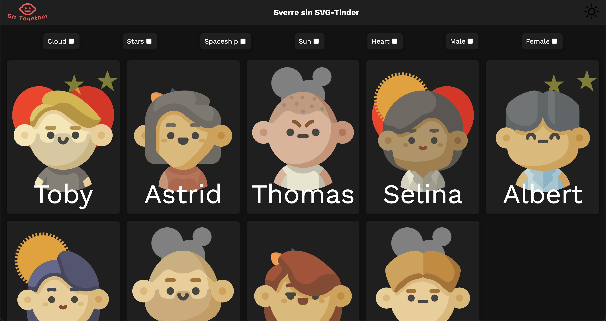
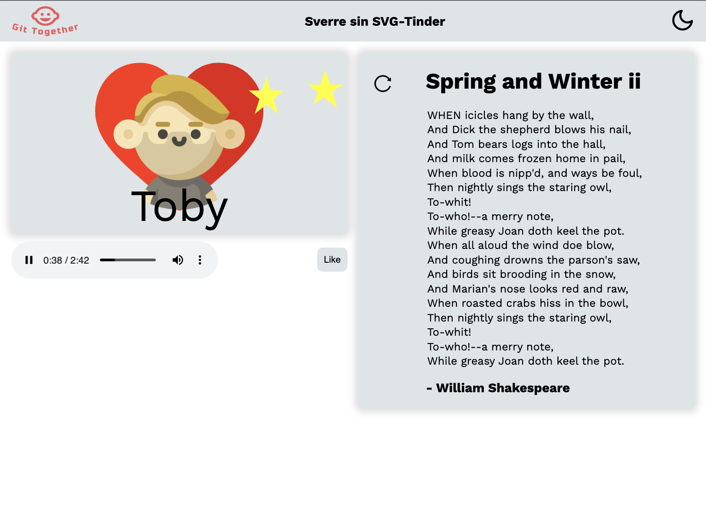
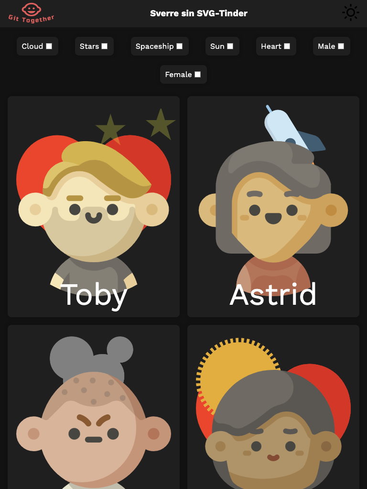
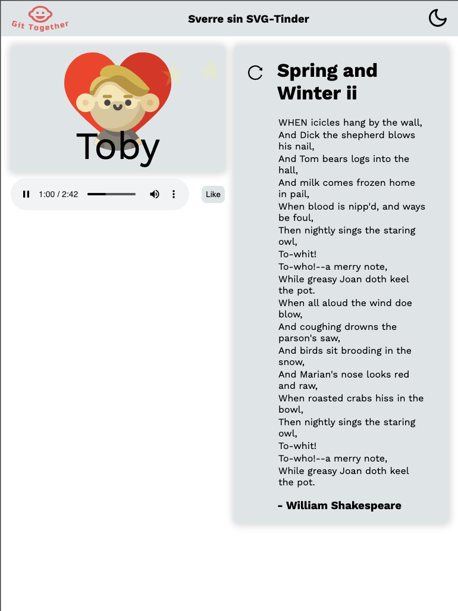
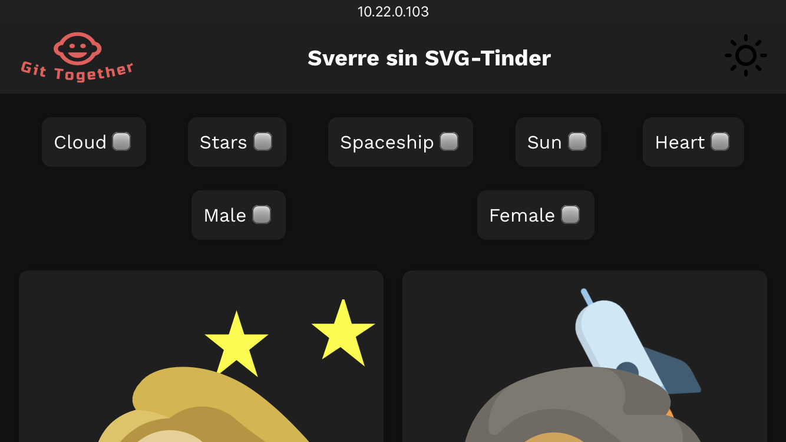
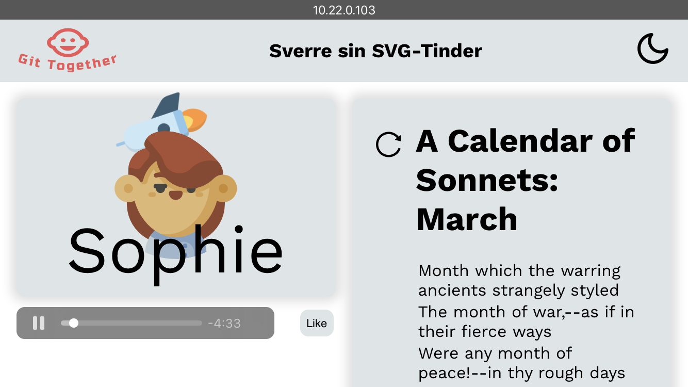
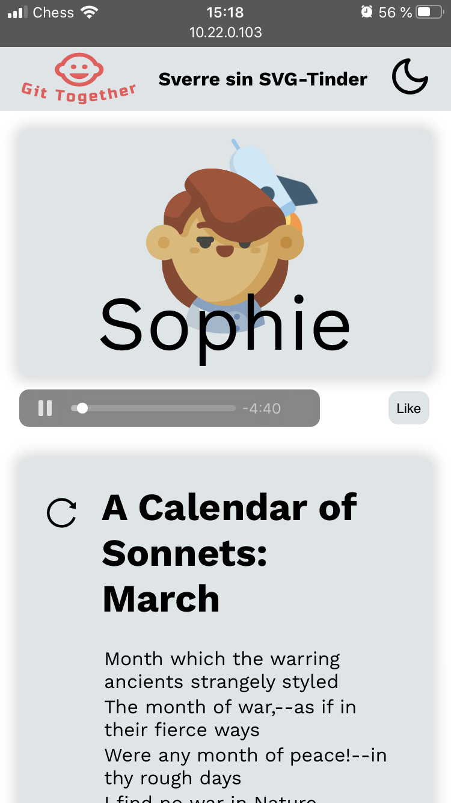

## Run project
In order to run the project you’ll need `yarn` (this is added in the gitpod project)

```
$ git clone git@gitlab.stud.idi.ntnu.no:it2810-h20/team-49/prosjekt2.git
$ cd prosjekt2
$ yarn			# Equivalent to npm install
$ yarn start	        # Equivalent to npm run start
```

### Run tests

```
$ yarn test
```

If you need new snapshots:

```
$ yarn test -u
```

### Run linter

```
$ yarn lint
```


## Structure

The app is modularized and divided into a structure fit for React.

**/root**: The root of the project contains app-specific configuration. Configuration for e.g. formatter (`Prettier`) and linter (`ESLint`) are defined here.
* **/src**: The source-code of the project <br/>
    * **/assets**: Includes static file resources such as `.svg`-files and `.mp3`-files.<br/>
    * **/components**: Includes every component used by the application. The folder is divided into subfolders where every subfolder includes components (`.tsx`-files) and stylesheets (`.css`-files) related to that specific area of concern.<br/>
    * **/config**: Includes source-specific configuration (Read more under Testing).<br/>
    * **/pages**: Even though this is a `single-page application` we have two main-pages; the `ProfileView` and the `GalleryView`. Both of these are included under `/pages`.<br/>
    * **/tests**: Contains every test associated with the application (Read more under Testing).<br/>
    * **/utils**: Contains `.ts`-files that function as utilities for the application. Services such as `AppContext` and `AppReducer` are defined here.<br/>

## Content and functionality 

In this project we have implemented a single page application with React. The application consists of a galleryview with nine profiles. Each profile consists of an SVG animation as a profile picture, name, favourite song and poems from its favourite author. The poems are fetched from PoetryDB (https://poetrydb.org/index.html). 

The user can interact with the application in order to change the display:

*  Change the coloring theme from light to dark using the icon in the upper right corner.
*  Filter the profiles by checking the boxes for animation categories, liked, female or male. 
* Like a profile using the like-button in profileview, giving it a heart as background image
* Fetch a new poem using the refresh icon next to the poem. 


At the beginning of a session you must write your preferred username and click somewhere outside of the container. This was implemented to show use of session storage and will be displayed at the header throughout your session. 

## React

The app is written in React with TypeScript. It primarily uses functional components in conjunction with `Hooks`, but we’ve also created a simple class-component `LikeButton` to showcase this approach. Functional components with Hooks makes the codebase more readable and facilitates for implementing the React Context-API much easier.

### State management:
The app contains local state in many components, but there’s also a global state management implemented with the React Context. Having state that’s accessible throughout the app prevents bad patterns like prop-drilling. 

The Context API is implemented in conjunction with a reducer, which in turn leaves the developers with a fully working state management system built entirely with proprietary React-functionality. 

State and actions are defined and initialized as `AppState` and  `AppActions`, and made available by wrapping the `App`-component in an `AppContextProvider`. Changes of the state are handled by the `AppReducer`.

E.g., in order to change the global darkmode variable, you’d do as in `Header.tsx` and dispatch an `AppAction` like this `appDispatch({ type: 'darkmode' });`. [Read more here](https://reactjs.org/docs/context.html)

## HTML web storage 

As the app’s full state is continuously updated, set and made available through `AppState`, we can save the `AppState` to localStorage and retrieve it on the next revisit. We do this by resetting the localStorage each time it changes. By doing this we enable the user to return to the state of the app, on which the user left. If there’s no cached localStorage, the app uses its `initialAppState` as provided by `AppContext`.

SessionStorage is leveraged to keep the user’s preferred username in storage throughout a session. 

## SVG 
We chose to use SVG for creating the images. Some of the SVG-elements we created and some were imported. All the characters, the heart, the spaceship and the sun/moon in the header were imported from https://www.svgrepo.com/. This was done to make our site look nice without using too much time on designing svg-photos since it’s not part of the evaluation. We have animated 4 different components; cloud, stars, spaceship and sun. The animation is created with keyframes in the css files; GalleryTile and profile. 

## AJAX and Sounds
For fetching poems from PoetryDB we used the library axios. In this simple app we could’ve used the built-in fetch(), but axios allows us, among other things, to cut out the middle step of passing the results of the http request to the .json() method.

The sounds are implemented with the HTML5 audio tag and are stored as mp3 files in the src/assets/mp3 folder. We had to import the files with require which is ES5 syntax since ES6 does not support mp3 imports yet. The imports can be found in src/utils/songsConverter.ts.

The different songs used are obtained from SoundCloud and are Royalty Free: 
* https://soundcloud.com/marogobran/sleep?in=hanangobran/sets/reading-music
* https://soundcloud.com/hanangobran2/pearl-harbor-ost?in=hanangobran/sets/reading-music
* https://soundcloud.com/yousra-samir93/forrest-gump-piano-theme
* https://soundcloud.com/hanangobran2/prisonbreak?in=hanangobran/sets/reading-music
* https://soundcloud.com/invadauk/old-boy-original-soundtrack-by-cho-young-wuk-kiss-me-deadly?in=hanangobran/sets/reading-music


## Responsive web design

### Flexible layout
Both of the main-pages (`GalleryView` and `ProfileView`) benefit from the `Grid layout`. They use `auto-fill` and `auto-fit` respectively in order to achieve the wanted dynamic, responsive layout. `Flex` is also commonly used throughout the application to achieve responsive layout in components with less area of concern. 

### Viewport
The viewport is by default set up in the `/public/index.html` as follows: `content="width=device-width, initial-scale=1"`. We saw no need to use viewport-specific units such as `vh` and `vw`, as the dynamic and responsive layout of the project fulfilled our needs.

### Media-queries
In cases where screens get so small that the responsive layout isn’t enough, we’ve inserted breakpoints to edit specific css-selectors.

### Scalable images
Every SVG-image used in the app scales according to the screen size.

## Yarn 
´Yarn´ was for a long time known to be way faster than ´npm´. Today that’s arguably a truth anymore, but the group members are more used to yarn, and chose this over `npm` for this project. The use of `npm` wouldn’t make any difference to the totality of the project.

## Use of git
During our development we have described tasks usings issues in GitLab. Every commit was to be on the form “#issuenumber description”, where the issue number corresponds to the issue on GitLab and the description describing what was contributed. We developed using branches corresponding to one or more issues. The branches were then merged to master via merge requests, the merge requests were to be accepted by someone else on the team. 


## Reuse of code
Some code snippets has been reused in order to quickly implement e.g. a `Spinner` for loading indication and `react-modal` for displaying a modal. 

* https://codepen.io/Benedikte/pen/bIuGr
* https://www.svgrepo.com/
* https://loading.io/css/
* https://www.npmjs.com/package/react-modal


## Testing

The tests (and snapshot) can be found under the `src/tests/` folder. For testing we have implemented a snapshot-test of the whole application. In addition we have a test for two of the functions; addFilter and removeFilter. We chose to add some extra tests to show how these tests can be implemented. However we didn’t add many more tests because in our opinion the time used on writing them versus the benefits in such a small project was not great enough. 

We have added some additional files so that the tests would run. The files are `jest.config.js`, `babel.config.js`, `src/config/cssImportFix.js` and `src/__mocks__/svgrMock.js`. The tests wouldn’t run with css, svg and png files before we added the files. 

Here are the pictures from testing the layout on Mac, Ipad and Iphone8. We have also tested on Iphone X, Iphone 8 Plus, Galaxy S5 and different computers.
When it comes to browsers we have tested the app in Chrome, Safari, Firefox and Opera and it works the same way in all the browsers.

| PC - Galleryview                                                              | PC - Profileview                                                              |
| ----------------------------------------------------------------------------- | ----------------------------------------------------------------------------- |
|              |              |
| IPad - Galleryview - Flat                                                     | IPad - Profileview - Flat                                                     |
|        |        |
| IPad - Galleryview - Standing                                                 | IPad - Profileview - Standing                                                 |
|     |     |
| IPhone8 - Galleryview - Flat                                                  | IPhone8 - Profileview - Flat                                                  |
|     |     |
| IPhone8 - Galleryview - Standing                                              | IPhone8 - Profileview - Standing                                              |
|  |  |
